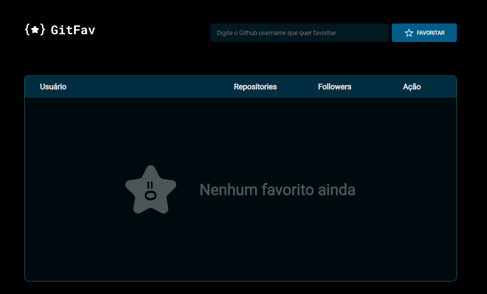
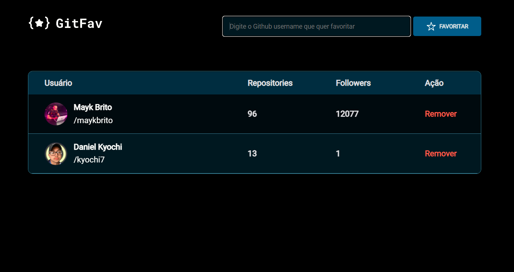

<h1 align="center"> Github Favorites</h1>

Projeto criado na aula de API, promovido pela Rocketseat para ensino de tecnologias WEB.

  <a href="#-tecnologias">Tecnologias</a>&nbsp;&nbsp;&nbsp;|&nbsp;&nbsp;&nbsp;
  <a href="#-projeto">Projeto</a>&nbsp;&nbsp;

 

  
  

## 🚀 Tecnologias

Esse desafio foi desenvolvido com as seguintes tecnologias:

- HTML e CSS
- JavaScript
- Git e Github

 

## 💻 Projeto

O Github Favorites tem como intuito favoritar os perfis do Github que mais gosta e podendo deixar salvo, para quando quiser dar uma olhadinha no seu perfil favorito. 

---

Feito com ♥ by Daniel Kyochi 🌍

